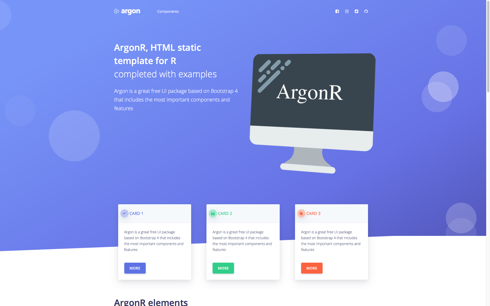

# argonR 

[](https://github.com/RinteRface/argonR/actions)
[](https://cran.r-project.org/package=argonR)
[](https://www.tidyverse.org/lifecycle/#maturing)
[](https://cran.r-project.org/package=argonR)
[](https://www.rpackages.io/package/argonR)

> R interface to argon HTML Bootstrap 4 template

## ArgonR philosophy
`{argonR}` primarily aims at building static webpages from R, without the need of shiny or server part. However,
it can be also used within shiny packages such as `{argonDash}`, a bootstrap4 shiny dashboard.
See [here](https://github.com/RinteRface/argonDash) for more details.

## Installation

```r
# from CRAN
install.packages("argonR")
# Latest version
devtools::install_github("RinteRface/argonR")
```

## Demo

See a demonstration [here](https://rinterface.com).

<br>
<a href="http://rinterface.com/shiny/argonR/" target="_blank"></a>

## How to host it?
This is pretty simple:
* Test it locally: after having generated your HTML page as described previously, 
open it with any web browser
* On apache or nginx server: copy example.html and the inst folder to the root of your
web server. Enter the web server adress in the web browser.
* On shiny-server: copy example.html and the inst folder to the root of your
shiny-server (usually /srv/shiny-server). Enter the web server adress in the web browser

## Use with shiny

See [{argonDash}](https://github.com/RinteRface/argonDash).

## Acknowledgement
* Many thanks to [Creative Tim](https://www.creative-tim.com/) for creating argon HTML.

## Code of Conduct
  
  Please note that the argonR project is released with a [Contributor Code of Conduct](https://contributor-covenant.org/version/2/0/CODE_OF_CONDUCT.html). By contributing to this project, you agree to abide by its terms.